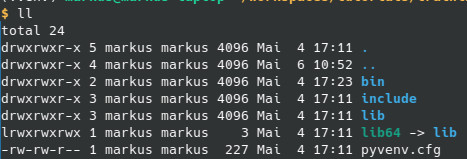
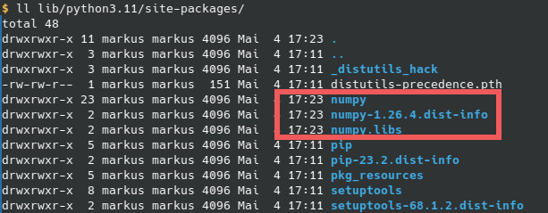

<style>
header {
  text-align: right;
  font-size: 0.7rem;
  color: #bbb;
  margin: 20px;
  left: 0px;
  right: 0px;
  padding-top: 5px;
}
footer {
  font-size: 0.7rem;
  color: #bbb;
}
section.lead {
  text-align: center;
  margin-bottom: 40px;
}
section {
  font-size: 1.2rem;
}
section.lead h1 {
  font-size: 2.5rem;
  font-weight: 600;
}
section.linked footer {
  display: none;
}
section.linked header {
  display: none;
}
section.quote {
  font-size: 1.0rem;
  text-align: center;
  font-style: italic;
  color: #555;
}

h1 {
  font-size: 2.5rem;
  font-weight: 500;
  color: #2B5A6A;
}
h2 {
  font-size: 1.8rem;
  font-weight: 400;
  color: #333;
  margin-top: 30px;
  margin-bottom: 15px;
  text-transform: uppercase;
}
a {
  color: #3A9FC1;
}
a:hover {
  color: #1E708B; 
  text-decoration: underline; 
}
ul {
  text-align: left
}

</style>

<!-- _class: lead -->
# Chapter 1 - Introduction to Python & Setup Development 
---
# Overview
* Setting up your development environment
  * Access Github/SSH
  * Checkout code
  * Install Python
* Write first program in Python
* Quick review of Python's most important features
* Virtual environments and dependency management
* Advanced features
* Resources:
  * https://www.w3schools.com/python/default.asp
* Docker

---
## Setup your dev environment
* Instructor works with Ubuntu Linux
* Tested with Python version 3.11
* To edit code Visual Studio Code is recommended https://code.visualstudio.com/ 
* If you can't make a Python environment run on your machine - you'll get a VM

---
## Notes on Installation
### Ubuntu Path
On Linux installing Python is fairly easy, it is usually supported by your OS' package manager. This is how this works on Ubuntu:
```bash
  sudo apt update
  sudo apt upgrade
  sudo apt install python3
  #check installation
  python3 --version
  # install pip packet manager
  sudo apt install python3-pip
  # update pip - we will use that in virtual envs
  pip install --upgrade pip
```

### Windows Path
On Windows you have two choices, install Python on Windows, or use WSL2 to run Ubuntu Linux.
* Basic installation: https://www.digitalocean.com/community/tutorials/install-python-windows-10 
* Alternative: Anaconda - https://docs.anaconda.com/free/anaconda/install/windows/

---
## Review Git
* Course material is stored on Github
* URL: https://github.com/starwit-trainings/python-ai-cv
* Create account at Github / [Generate SSH key](https://docs.github.com/en/authentication/connecting-to-github-with-ssh/generating-a-new-ssh-key-and-adding-it-to-the-ssh-agent?platform=windows) 
* Checkout/Clone repository
```bash
  git clone git@github.com:starwit-trainings/python-ai-cv.git
  git checkout -b yourname # create a new branch with your name
  git add yourchanges.py
  git commit -m"meaningful comment"
  git push -u origin yourname # just the first time, for a new branch
```
* Why git flow matters
* On .gitignore
---
# Introduction to the Python Programming Language
* Invented in the 1990ies
* Sort of platform independent
* Both interpreter & compiler
* Foreign Function Interface - or why Python is useful at all
* In a way Python is glue code, to call compute intense functions, not written in Python
* On Multithreading
* We use [CPython](https://en.wikipedia.org/wiki/CPython#:~:text=CPython%20is%20the%20reference%20implementation,CPython)
---
## Language Features
* [Language overview](https://en.wikipedia.org/wiki/Python_(programming_language))
* dynamically typed
* Garbage collected - sort of
* multiple paradigms
* procedural, object oriented, functional
* Shell vs running programs
* Large function library included
* Vast eco-systems of third party libs -> pip
* Indentations...
---
## Hello World
```bash
  python3 scripts/01-hello-world.py 
```
---
## Language Introduction
* [Conditionals](scripts/02-control-flow.py) & [Loops](scripts/04-loops.py)
* [Exceptions](scripts/03-exceptions.py)
* [Lists, Dictionaries](scripts/05-lists-dictionaries.py), [JSON](scripts/07-using-JSON.py)
* And Arrays?
* [Imports & Libraries](scripts/06-importing-from-libs.py)
* [Functions & Parameters](scripts/08-functions.py)
* [Objects & Classes](scripts/09-oop.py) - very brief (abstract classes, interfaces, (multi)inheritance)
---
## Install Libraries & virtual environments
* pip can be used to install libraries, however no more than one version per lib
* Solution: Virtual Environments
```bash
  python3 -m venv .venv
  source .venv/bin/activate
```

```bash
  pip install numpy
```


---
### Virtual envs in detail
* venv folder should considered as temporary - nothing peristent belongs there!
* it mostly mirrors central folder structures


---

## Advanced Features
* [Working with files](advanced-features/01-working-with-files.py)
* [HTTP requests](advanced-features/02-http-requests.py)
  * pip install requests
* [Simple GUI](advanced-features/03-simple-gui.py)
* [On main and parameters](advanced-features/04-on-main.py)

---
# Introduction to Docker
* How does it work and what is good for?
* Tasks
  * Installation Linux/Windows
  * Run container
  * Build your own images
* About Credentials
* Docker Compose