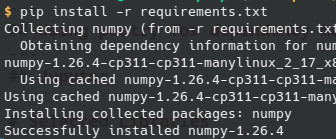
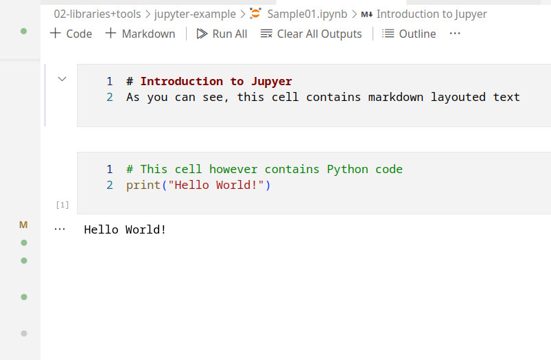

<!-- _class: lead -->
# Chapter 2 - Tools & Libraries
---
## Overview
In this chapter various helpful tools and libraries are introduced, that are essential, to make developing with Python easier.
* Pip with requirements
* Poetry https://python-poetry.org/
* Jupyter
* numpy
* matplotlib/plotly/seaborn
* SciPy
* statistics module
* Pandas
---
## What is dependency management
* Collecting all libraries automatically
* Keep control on lib versions
* Enable automatic builds -> sine qua non releasing!
* Also for individual projects
* Makes your code usable for others
* Version control, documentation & dependency management - never without any of those!
* Python packages are listed here: https://pypi.org/
---

## Using pip for dependency management
* pip standard dependency management tool
* downloads and unpacks libraries
* Example requests: https://pypi.org/project/requests/
* Libs can be installed globally, per user or in virtual environments
* Recursive - dependencies of dependencies
* But: multiple versions of same library are not possible -> virt envs
* For this course we will use pip

---
### Pip requirements example
* Pip can download all packages listed in __requirements.txt__
* Fix version number/range for libs
  * numpy==1.26.4 vs requests>=2.31.0 
* Multiple calls result in same target state
* Run example
```bash
  cd 01-depmanagement-pip
  python3 -m venv .venv
  source .venv/bin/activate
  pip install -r requirements.txt 
```


__Make sure you understand this idea - we will use from now on!__

---
## Using poetry for dependency management
* same library repository as pip
* support to build _and_ publish
* [TOML](https://en.wikipedia.org/wiki/TOML) file for config
* Much more powerfull than pip
---
### Poetry example
* Install Poetry
  ```bash
  apt install python3-poetry
  ```
* Run example
  ```bash
    cd 02-depmanagement-poetry
    TODO
  ```
---
# Docker Compose & TimescaleDB
* [TimescaleDB](https://www.timescale.com/) extension of PostgreSQL database for time series data
* Nice set of [functions](https://docs.timescale.com/api/latest/)
* If you don't like command line operations use [pgAdmin](https://www.pgadmin.org/download/)
* [Example](04-timeseries/01-connect-timescaledb.py) how to connect from Python
* Task
  * measure response time of web address and write to CSV file [Task](03-timeseries/02-measure-response-time.py)
  * Write same data into a time series data base [hint](https://docs.timescale.com/quick-start/latest/python/)
---
## Timescale Tips
* Timescale supports large time series tables (hypertables)
### Create Table & HyperTable
```SQL
  CREATE TABLE public.responsetimes
  (
    "url" TEXT NOT NULL,
    "measuretime" timestamp with time zone NOT NULL,
    "responsetime" BIGINT NOT NULL
  );
  SELECT create_hypertable('responsetimes', 'measuretime');
```  
### Sample Input
```SQL
  INSERT INTO public.responsetimes ("url", "measuretime", "responsetime")
  VALUES ('http://worldtimeapi.org/api/timezone/Europe/Berlin', '2024-06-06 12:34:56+00', 54782);
```
---
## Jupyter
* Typical data exploration workflow:
  * load data
  * show sample data
  * write analysis code
  * show results
  * extend code
* Jupyter is a tool, that supports this workflow
* We use classic notebooks (intensively) for this course
* VSCode extension: Jupyter
* Note: Notebooks can and should be under version control
---
### Setting up Jupyter
Jupyter can be run as a browsable service like so:
```bash
  cd jupyter-example
  python3 -m venv .venv
  source .venv/bin/activate
  pip install -r requirements.txt 
  jupyter notebook
```

Last command will open a browser tab and you can start working with notebooks.

VSCode can run notebooks and that is the preferred usage for this course. Use the power of an IDE :)

---
### Running example

Running a notebook in VScode



---
### Virtual envs, VSCode & Jupyter
VSCode supports running Jupyter notebooks code in virtual environments:

* Keep in mind to manage your notebooks and virtual envs

---
# Selected Libraries

The following section introduces selected Python libraries, that are useful for data analytics and AI projects. It is by no means complete and will be extended.

---
## Numpy
* NumPy: numeric Python - actually C -> fast
* Mostly for matrix operations
* Large set of mathematical functions
* used by everything
* https://numpy.org/doc/1.26/user/absolute_beginners.html
* https://www.w3schools.com/python/numpy/ 
* [Examples and tasks](05-numpy/)

---
## Plotting data
* numbers are boring
* many libs in Python for the job available
* GUI framework is necessary - unless you use Jupyter
* Tcl/Tk as (ugly) standard
  ```bash
  apt install python3-tk
  ```
* [Examples and tasks](06-plotting/)

---
## SciPy
* SciPy: Scientific Python
* Builds on top of numpy, large set of more mathematical functions
* https://scipy.org/
* To a certain degree an alternative to MATLAB
* [Examples and tasks](07-scipy/)

---
## statistics module
* Part of Python standard libs
* Basic statistical functions
* If it works - don't use more complicated stuff
* [Examples and tasks](08-statistics/)

---
## Pandas
* library for time series and numerical tables
* easy import/export to various data sources (CSV,SQL)
* "Excel for Python"
* [Examples and tasks](09-pandas/)

<style>
header {
  text-align: right;
  font-size: 0.7rem;
  color: #bbb;
  margin: 20px;
  left: 0px;
  right: 0px;
  padding-top: 5px;
}
footer {
  font-size: 0.7rem;
  color: #bbb;
}
section.lead {
  text-align: center;
  margin-bottom: 40px;
}
section {
  font-size: 1.2rem;
}
section.lead h1 {
  font-size: 2.5rem;
  font-weight: 600;
}
section.linked footer {
  display: none;
}
section.linked header {
  display: none;
}
section.quote {
  font-size: 1.0rem;
  text-align: center;
  font-style: italic;
  color: #555;
}

h1 {
  font-size: 2.5rem;
  font-weight: 500;
  color: #2B5A6A;
}
h2 {
  font-size: 1.8rem;
  font-weight: 400;
  color: #333;
  margin-top: 30px;
  margin-bottom: 15px;
  text-transform: uppercase;
}
a {
  color: #3A9FC1;
}
a:hover {
  color: #1E708B; 
  text-decoration: underline; 
}
ul {
  text-align: left
}

</style>